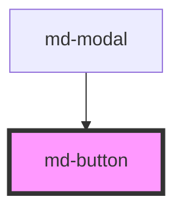

# md-button

<!-- Auto Generated Below -->

## Properties

| Property     | Attribute     | Description | Type                              | Default     |
| ------------ | ------------- | ----------- | --------------------------------- | ----------- |
| `buttonType` | `button-type` |             | `"button" \| "reset" \| "submit"` | `'button'`  |
| `disabled`   | `disabled`    |             | `boolean`                         | `undefined` |
| `size`       | `size`        |             | `"large" \| "medium" \| "small"`  | `'medium'`  |

## Events

| Event         | Description | Type                |
| ------------- | ----------- | ------------------- |
| `buttonClick` |             | `CustomEvent<void>` |

## Dependencies

### Used by

 - [md-modal](../md-modal)

### Graph

----------------------------------------------

*Built with [StencilJS](https://stenciljs.com/)*
