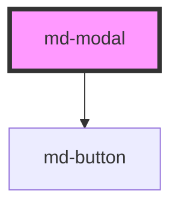

# md-modal

<!-- Auto Generated Below -->

## Properties

| Property     | Attribute     | Description | Type      | Default            |
| ------------ | ------------- | ----------- | --------- | ------------------ |
| `isOpen`     | `is-open`     |             | `boolean` | `false`            |
| `modalTitle` | `modal-title` |             | `string`  | `'My modal title'` |

## Events

| Event        | Description | Type                |
| ------------ | ----------- | ------------------- |
| `closeModal` |             | `CustomEvent<void>` |

## Methods

### `close() => Promise<void>`

#### Returns

Type: `Promise<void>`

### `open() => Promise<void>`

#### Returns

Type: `Promise<void>`

## Dependencies

### Depends on

- [md-button](../md-button)

### Graph

----------------------------------------------

*Built with [StencilJS](https://stenciljs.com/)*
